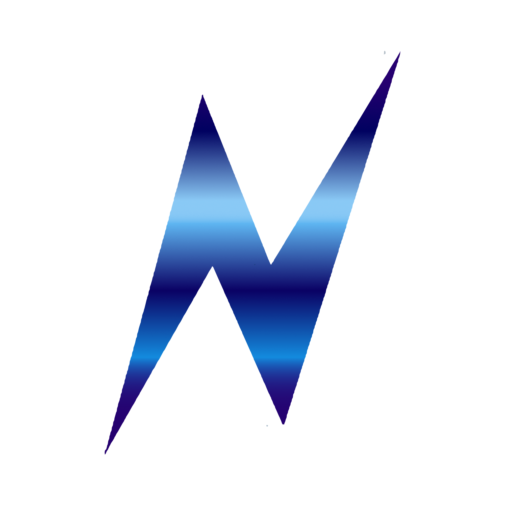

<!-- EXEMPLOS PARA REFERÊNCIA -->
<!-- https://github.com/bearbob/pyle -->

<!-- # Título -->
# NEURON

<!-- ## Descrição -->
<!-- O que é o jogo -->
<!-- Com o que (linguagem) foi construído -->
<!-- Por que foi criado -->

__NEURON__ é um jogo de enigmas em tabuleiro físico controlado por sensor de voz, permitindo-lhe ser jogado por pessoas com deficiências motoras graves. 

A dinâmica do jogo representa o processamento de ideias e memórias em um cérebro confuso. O tabuleiro é o mapa dessa mente em confusão, onde você assume o papel de um pulso elétrico destinado a restaurar a ordem. Faça-o antes dos seus adversários, ou perca-se para sempre nas lacunas do esquecimento.

## Características
* **Acessibilidade e Inclusão:** Controle do jogo realizado inteiramente por comandos de voz, garantindo a participação autônoma e integradora de pessoas com deficiências motoras graves.
* **Interface Digital:** Plataforma visual onde os enigmas são apresentados aos jogadores e onde a validação das respostas acontece.
* **Tabuleiro Físico:** Estrutura interativa que mapeia o progresso da partida e sinaliza de forma clara o posicionamento de cada competidor no mundo real.
* **Integração Físico-Digital:** Experiência híbrida onde a resolução de enigmas em uma interface digital gera avanços luminosos no tabuleiro físico em tempo real.
* **Dinâmica Desafiadora:** Enigmas complexos que exigem intuição e raciocínio lógico para serem desvendados.
* **Multijogador Competitivo:** Desenvolvido para partidas dinâmicas e emocionantes no formato "cada um por si", reunindo 4 jogadores.

## Componentes e Tecnologias
#### Hardware (Estrutura Física e Eletrônica)
* **Arduino Mega 2560:** Placa microcontroladora principal responsável por receber os comandos e controlar a iluminação.
* **Componentes Eletrônicos:** __20x__ Pin LEDs inseridos no tabuleiro (__5x__ Vermelhos, __5x__ Verdes, __5x__ Azuis, __5x__ amarelos) e fiação correspondente (jumpers e resistores).
* **Estrutura Física:** Tabuleiro do jogo construído e cortado em MDF.

#### Software e Bibliotecas
* **Python:** Linguagem principal (back-end) utilizada para a lógica de validação dos enigmas e processamento de voz.
* **Modelo Vosk:** Ferramenta de reconhecimento de voz (Speech Recognition) em Python para capturar os comandos do jogador offline.
* **pySerial:** Biblioteca Python utilizada para estabelecer a comunicação serial e enviar comandos do computador para o Arduino.
* **C++ (Arduino IDE):** Linguagem utilizada para programar o Arduino Mega, interpretando os dados recebidos via porta serial e acionando os pinos dos LEDs correspondentes.

#### Interface Gráfica (Front-end)
* **HTML5:** Estrutura base da interface gráfica aberta no navegador do computador, onde os enigmas são apresentados aos jogadores.
* **CSS3:** Inserido diretamente no próprio arquivo HTML, é responsável pela estilização visual da interface web, garantindo um design imersivo e atraente para o ambiente do jogo.
* **JavaScript:** Lógica de interatividade na página web, responsável por gerir os eventos do utilizador e fazer a ponte de comunicação dinâmica com a validação em Python.

## Instrução de instalação
<!-- Montagem -->
1. 
2. 
3. 
4. 

## Instrução de uso
<!-- Como jogar -->
1. 
2. 
3. 
4. 

<!-- ## Licença -->
<!-- Dar permissão para uso comercial ou educacional somente -->
