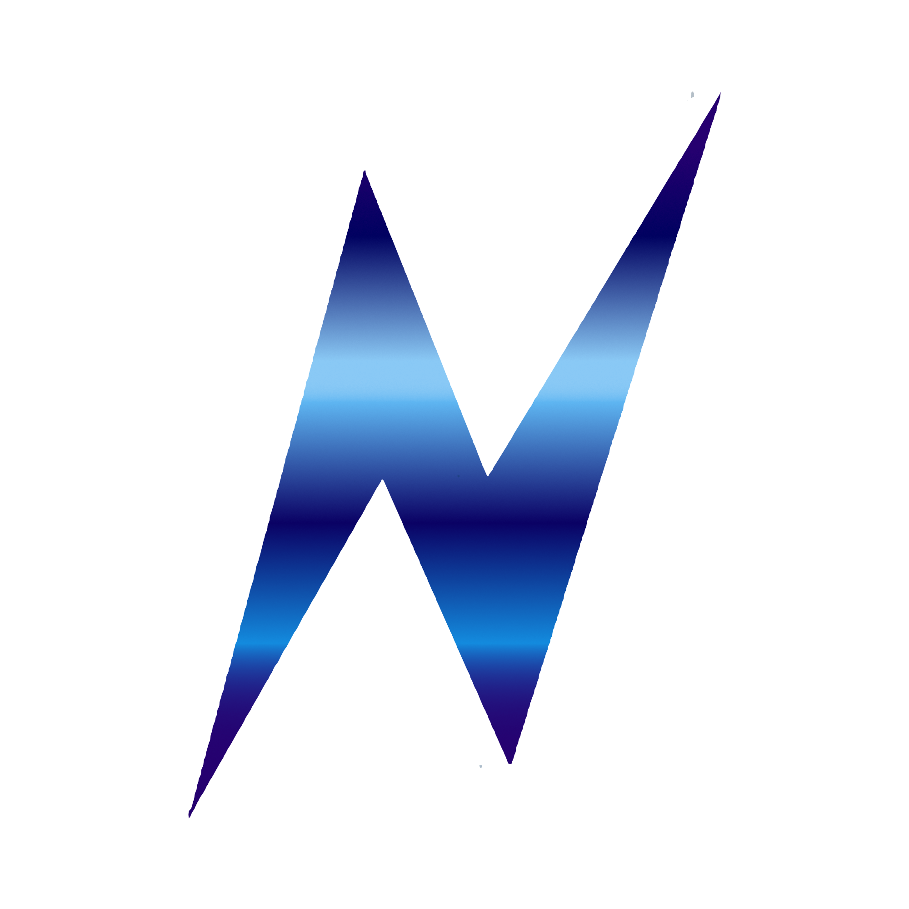

<!-- EXEMPLOS PARA REFERÊNCIA -->
<!-- https://github.com/bearbob/pyle -->

<!-- # Título -->
# _NEURON_

<!-- ## Descrição -->
<!-- O que é o jogo -->
<!-- Com o que (linguagem) foi construído -->
<!-- Por que foi criado -->

___NEURON___ é um jogo de enigmas em tabuleiro físico controlado por sensor de voz, permitindo-lhe ser jogado por pessoas com deficiências motoras graves. 

A dinâmica do jogo representa o processamento de ideias e memórias em um cérebro confuso. O tabuleiro é o mapa dessa mente em confusão, onde você assume o papel de um pulso elétrico destinado a restaurar a ordem. Faça-o antes dos seus adversários, ou perca-se para sempre nas lacunas do esquecimento.

## Características
* **Acessibilidade e Inclusão:** Controle do jogo realizado inteiramente por comandos de voz, garantindo a participação autônoma e integradora de pessoas com deficiências motoras graves.

* **Interface Digital:** Plataforma visual onde os enigmas são apresentados aos jogadores e onde a validação das respostas acontece.

* **Tabuleiro Físico:** Estrutura interativa que mapeia o progresso da partida e sinaliza de forma clara o posicionamento de cada competidor no mundo real.

* **Integração Físico-Digital:** Experiência híbrida onde a resolução de enigmas em uma interface digital gera avanços luminosos no tabuleiro físico em tempo real.

* **Dinâmica Desafiadora:** Enigmas complexos que exigem intuição e raciocínio lógico para serem desvendados.

* **Multijogador Competitivo:** Desenvolvido para partidas dinâmicas e emocionantes no formato "cada um por si", reunindo 4 jogadores.

## Componentes e Tecnologias
### Hardware (Estrutura Física e Eletrônica)
* **Arduino Mega 2560:** Placa microcontroladora principal responsável por receber os comandos e controlar a iluminação.

* **Componentes Eletrônicos:** __20x__ Pin LEDs inseridos no tabuleiro (__5x__ Vermelhos, __5x__ Verdes, __5x__ Azuis, __5x__ amarelos) e fiação correspondente (jumpers e resistores).

* **Estrutura Física:** Tabuleiro do jogo construído e cortado em MDF.

### Software e Bibliotecas
* **Python:** Linguagem principal (back-end) utilizada para a lógica de validação dos enigmas e processamento de voz.

* **Modelo Vosk:** Ferramenta de reconhecimento de voz (Speech Recognition) em Python para capturar os comandos do jogador offline.

* **pySerial:** Biblioteca Python utilizada para estabelecer a comunicação serial e enviar comandos do computador para o Arduino.

* **C++ (Arduino IDE):** Linguagem utilizada para programar o Arduino Mega, interpretando os dados recebidos via porta serial e acionando os pinos dos LEDs correspondentes.

### Interface Gráfica (Front-end)
* **HTML5:** Estrutura base da interface gráfica aberta no navegador do computador, onde os enigmas são apresentados aos jogadores.

* **CSS3:** Inserido diretamente no próprio arquivo HTML, é responsável pela estilização visual da interface web, garantindo um design imersivo e atraente para o ambiente do jogo.

* **JavaScript:** Lógica de interatividade na página web, responsável por gerir os eventos do utilizador e fazer a ponte de comunicação dinâmica com a validação em Python.

## Instruções de instalação
<!-- Montagem -->
1. Instale [__Arduino IDE__](https://www.google.com/url?sa=t&source=web&rct=j&opi=89978449&url=https://support.arduino.cc/hc/en-us/articles/360019833020-Download-and-install-Arduino-IDE&ved=2ahUKEwiYlInwjJGVAxV2iJUCHW8TDz8QFnoECB8QAQ&usg=AOvVaw0s79uBSeG4pn1yM8_D6FiB)
1. Instale ou tenha instalado o [__VSCode__](https://code.visualstudio.com/download) (ou outra IDE de sua preferência) em seu computador.
2. Após isso, instale [__Python__](https://www.python.org/downloads/) em sua computador.
3. Copie o comando ___pip install -U numpy pyserial sounddevice Flask openai-whisper___, cole no Terminal (Acesse com __Control + J__) da IDE instalada e pressione __Enter__.
4. Com o repositório Github do _NEURON_ aberto, clique no botão verde __Code__. Com __HTTPS__ selecionado, clique em __Download ZIP__ para instalar os códigos do jogo no seu computador.
5. Abra o __Explorador de Arquivos__ do seu computador. Pesquise o arquivo ZIP pelo nome como foi salvo. Ao encontrá-lo, selecione-o e pressione __Enter__ para descomprimí-lo.
6. Abra a IDE instalada. No canto superior esquerda da tela, encontre e clique em __Open Folder__. Selecione a pasta descomprimida e pressione __Enter__.
7. Abra o __Arduino IDE__ e clique em __NOVO ESBOÇO__. Acesse a pasta descomprimida e abra o arquivo __neuron.ino__.
8. Conecte o cabo que sai de dentro do tabuleiro na entrada HDMI do seu computador.
9. Rode o programa no Arduino IDE clicando na __seta pra direita__ no canto superior esquerdo e, em seguida, encerre (feche) o Arduino IDE.
10. Abra a sua outra IDE e, no canto esquerdo da tela, clique no arquivo intitulado __placar_voz.py__. Com o seu código aberto, clique no botão __Play (um triângulo deitado)__ no canto superior direito da tela.

11. Pronto! __Divirta-se!__

## Instruções de uso
<!-- Como jogar -->

* O jogo iniciará com o piscar de todas as LEDs para sinalizar seu funcionamento. Encerrado isso, uma das fileiras de LEDs (de uma das cores) acenderá por um curto intervalo de tempo para indicar o jogador que será o __Host__. O __Host__ é o jogador responsável por dar os comandos do jogo, como __"Acender LED vermelho"__ quando o jogador correspondente acertar a resposta de um enigma.

* De tempos em tempos, um som vai ser emitido do jogo, que pode sonar de forma __contínua__ ou __intervalada__. Para o primeiro caso (som contínuo), __qualquer jogador pode responder o enigma que estiver na tela__, mesmo que não seja sua rodada. Para o segundo caso (som intervalado), a partir da próxima rodada o jogo __inverterá seu sentido__ (considere que a ordem dos jogadores deve começar no sentido horário)

### Comandos de voz
#### &emsp;__Comandos de tela__
* Ir para o próximo enigma:
    * "Próxima pergunta"
    * "Próximo enigma"
    * "Próximo enigma"
    * "Seguinte"

* Voltar para o enigma anterior:
    * "Voltar"
    * "Enigma anterior"

* Revelar resposta para o enigma:
    * "Mostrar resposta"
    * "Revelar resposta"

* Mostrar pergunta:
    * "Mostrar pergunta"

#### &emsp;__Comandos do tabuleiro__
* Acender LED (unidade):
    * "Ponto [cor]"
    * "Dois pontos [cor]"

* Apagar LED (unidade)
    * "Menos ponto [cor]

* Apagar LED (conjunto)
    * "Zerar [cor]" - Apaga todas as LEDs da cor escolhida
    * "Zerar tudo" - Apaga todas as LEDs

<!-- ## Licença -->
<!-- Dar permissão para uso comercial ou educacional somente -->
